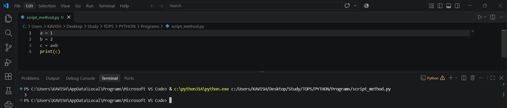

<div align="center">

# 🐍✨ Python

> **Python is a high-level, general-purpose programming language** known for its simple syntax, readability, and ease of learning.

### 👨‍💻 Created by Guido van Rossum | 📅 First Released in 1991

</div>

---

## 📌 About Python

| ✨ | Details |
|---|---|
| 🟢 | Python is **open-source** and freely available. |
| 🔤 | It is a **dynamically/vercitle typed** language. |
| 📖 | Python has a simple and readable syntax. |
| 📄 | Python programs use the **.py** file extension. |
| 🧩 | Python supports **procedural, object-oriented, and functional programming**. |

---

## 🚀 Uses of Python

Python is widely used in many fields:

| # | 💡 Field | 🛠️ Examples / Technologies |
|---:|---|---|
| 1 | 🌐 **Web Development** | Django, Flask, FastAPI |
| 2 | 📊 **Data Analysis** | NumPy, Pandas |
| 3 | 🔬 **Data Science** | NumPy, Pandas, SciPy |
| 4 | 🤖 **Artificial Intelligence & Machine Learning** | Scikit-learn, Keras, Linear Regression |
| 5 | ⚙️ **Automation & Scripting** | Python Scripts, Task Automation |
| 6 | 💻 **Software Development** | Desktop & Application Development |
| 7 | 🧪 **Scientific Computing** | SciPy, NumPy |
| 8 | 🛡️ **Cybersecurity** | Security Tools & Automation |

---

## 💻 Simple Python Example

```python
print("Hello, World!")
```

### 📤 Output

```text
Hello, World!
```

---

## 🐍 Ways to Run Python

Python programs can be executed in different environments:

> 🔹 **Python Interpreter**  
> 🔹 **VS Code**  
> 🔹 **Python IDLE**  
> 🔹 **Jupyter Notebook**  
> 🔹 **Command Prompt / Terminal**

---

## 🐍 REPL

**REPL** stands for:

> 🔹 **R** = Read  
> 🔹 **E** = Evaluate  
> 🔹 **P** = Print  
> 🔹 **L** = Loop

### ⚠️ Disadvantages

> 🔹 Run on CMD
>
> 🔹 Does not store any backup
>
> 🔹 How to start in CMD: run `python`

Example:

```text
>>> name = 'brijesh'
>>> print(name)
brijesh
>>> a = 10
>>> b = 20
>>> print("additions of numbers is :", c)
Traceback (most recent call last):
File "<python-input-4>", line 1, in <module>
print("additions of numbers is :",c)
    ^
NameError: name 'c' is not defined
>>> print("additions of numbers is :", a + b)
additions of numbers is : 30
>>> name = input('enter your age:')
enter your age:25
>>> print(name)
25
>>>

>>> age = 18
>>> if age >= 18:
...     print('i am adult')
...     else:
...         print('i am child')
...
  File "<python-input-9>", line 3
    else:
    ^^^^
SyntaxError: invalid syntax
>>> if age>=18:
...     print('i am adult')
... else:
...     print('i am child')
...
i am adult
>>> for i in range(1, 6):
...     print(i)
...
1
2
3
4
5
>>>
```

---

## 📜 Script Method



> 🔹 Script method is used to create a file with `.py`.
>
> 🔹 Script method stores backup files.
>
> 🔹 Script can also be used in the IDE Terminal.

---

## 🧮 Python Variables

> 📦 A variable is like a container where we store information about data.
>
> 🔹 A variable stores information about data.
>
> 🐍 Python is a high-level language, so variables do not need to be assigned with data types.


---

## 🧩 Python Built-in Data Types

| Data Type | Example |
|---|---|
| 🔢 **Integer (`int`)** | `age = 20` |
| 🔢 **Float (`float`)** | `price = 99.5` |
| 🔤 **String (`str`)** | `name = "Kavish"` |
| ✅ **Boolean (`bool`)** | `is_passed = True` |
| 📋 **List (`list`)** | `numbers = [1, 2, 3]` |
| 📦 **Tuple (`tuple`)** | `data = (10, 20, 30)` |
| 🔹 **Set (`set`)** | `items = {1, 2, 3}` |
| 🗂️ **Dictionary (`dict`)** | `student = {"name": "Kavish", "age": 20}` |
| 🚫 **None (`NoneType`)** | `result = None` |

### 💡 Examples

```python
age = 20
price = 99.5
name = "Kavish"
is_passed = True

numbers = [1, 2, 3]
data = (10, 20, 30)
items = {1, 2, 3}
student = {"name": "Kavish", "age": 20}
result = None
```

## Rules to define Variables
> We cannot use reserve key words to assign a variable
> we cannot start a variable with nummber.
> we use special smbol (i.e only '_' underscore can be used)
### 💡 Example
we cannot take white space with variable

```python
a = 10
b = 20
c = "hi"
d = 'hey brijesh'
e = '''
i am brijesh 
done Mtech
'''
# single line comment
# print is inbuilt function that can print user values 
print(e)
```

---

## 🖥️ Creating a Windows Application

```python
import tkinter as tk
# create a windows screen 
root = tk.Tk()
# create a title of windows app 
root.title('vaidehi notepad app')
# create a geometry
root.geometry('550x468')
# print windows app 
tk.mainloop()
```

---

## ⭐ Why Learn Python?

Python is popular because it is:

- 🎯 **Easy to Learn**
- ✍️ **Easy to Read and Write**
- 🔄 **Versatile**
- 🌍 **Open-Source**
- 👥 **Supported by a Large Community**
- 📚 **Rich in Libraries and Frameworks**

> 💡 Python is especially useful for beginners because its syntax is clean and relatively close to natural language.

---

## 📄 Python File Extension

> 🐍 Python source files use the **`.py`** extension.

---

## 💬 Comments in Python

Comments are used to add explanations or notes to Python code. They are ignored during normal program execution.

### 🔹 Single-Line Comment

A single-line comment starts with the `#` symbol.

ctrl + ? shortcut for making all comment

```python
# Hello World
print("Hello World")
```

### 🔹 Multi-Line Comments

Python does not have a dedicated multi-line comment syntax. Triple-quoted strings are commonly used for multi-line documentation or text blocks.

```python
'''
Hello World
This is a multi-line text block.
'''
```

> 💡 **Note:** For functions, classes, and modules, triple-quoted strings are commonly used as **docstrings**.

---

## 📦 What is Module?

> 🧩 A module is that file which is run after saving it as **.py**.
>
> ♻️ Modules are reusable.

### 🔹 Sub Types

1. 👨‍💻 **User-Defined** = Defined by users, can be named by the user, and is reusable.

```python
mymodule.py
import mymodule
mymodule.greet()
def greet():
    print("Hello from my module!")

import mymodule
mymodule.greet()
```

2. 🐍 **Pre-Defined** = system defined, already defined so no need to install because they are pre-defined

```python
import sys
result = sys.version_info //used to print version of python in detail
print(result)

or

import math
num = int(input("Enter a Number"))
print(math.pow(num,2))

or

import datetime
print(datetime.datetime.now)

or

import calendar
print(calendar.calendar(2026))
print(calendar.calendar.month(2026,9))

or

import random
print(random.randomint(1,10))
```

3. 📦 **Third-Party** = Pre-made modules made by other people or users.

> 📦 **What is pip?**

> Python Package Installer, used to install packages or modules.

---

## ⚙️ Operators

> 🔹 Operators are used to perform actions on values.
>
> 🔹 **Operand** = The value on which an operator works.

### 🔢 1. Arithmetic Operators

| Operator | Example | Meaning |
|---|---|---|
| `+` | `5 + 2` | Addition |
| `-` | `5 - 2` | Subtraction |
| `*` | `5 * 2` | Multiplication |
| `/` | `5 / 2` | Division |
| `%` | `5 % 2` | Remainder |
| `**` | `5 ** 2` | Power |
| `//` | `5 // 2` | Floor division |

### 📝 2. Assignment Operators

| Operator | Example | Meaning |
|---|---|---|
| `=` | `x = 5` | Assign |
| `+=` | `x += 2` | Add & assign |
| `-=` | `x -= 2` | Subtract & assign |
| `*=` | `x *= 2` | Multiply & assign |
| `%=` | `x %= 2` | Remainder & assign |

### ⚖️ 3. Comparison Operators

| Operator | Example | Meaning |
|---|---|---|
| `>` | `5 > 2` | Greater than |
| `<` | `5 < 2` | Less than |
| `>=` | `5 >= 2` | Greater/equal |
| `<=` | `5 <= 2` | Less/equal |
| `==` | `5 == 5` | Equal |
| `!=` | `5 != 2` | Not equal |

### 🧠 4. Logical Operators

| Operator | Example | Meaning |
|---|---|---|
| `and` | `True and False` | Both true |
| `or` | `True or False` | Either true |
| `not` | `not True` | Reverses result |

### 💾 5. Bitwise Operators

| Operator | Example | Meaning |
|---|---|---|
| `&` | `5 & 3` | AND |
| `|` | `5 | 3` | OR |
| `^` | `5 ^ 3` | XOR |
| `~` | `~5` | NOT |
| `<<` | `5 << 1` | Left shift |
| `>>` | `5 >> 1` | Right shift |

### 🪪 6. Identity Operators

| Operator | Example | Meaning |
|---|---|---|
| `is` | `a is b` | Same object |
| `is not` | `a is not b` | Different object |

### 🔀 7. Conditional / Ternary Operator

| Operator | Example | Meaning |
|---|---|---|
| Ternary | `x if condition else y` | Short if-else |

### 🔎 8. Membership Operators

| Operator | Example | Meaning |
|---|---|---|
| `in` | `2 in [1, 2]` | Exists in sequence |
| `not in` | `3 not in [1, 2]` | Does not exist in sequence |

### 🔄 9. Increment / Decrement Operators

| Operator | Example | Meaning |
|---|---|---|
| `++` | `x++` | Increment |
| `--` | `x--` | Decrement |

> ⚠️ **Note:** Python does **not** support `++` or `--` operators.
>
> 🔹 Use `x += 1` to increment.  
> 🔹 Use `x -= 1` to decrement.

---

<div align="center">

### 🐍✨ Python • Learn • Build • Create ✨🐍

</div>
